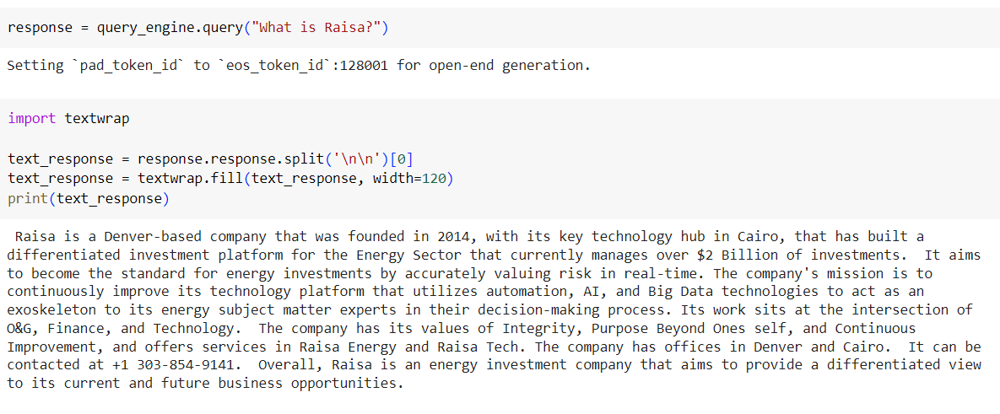

# Simple RAG for Raisa Energy

This is a simple RAG based on the home page of [Raisa](https://www.raisa.com/) with a FastAPI endpoint

## Usage 

You can use it to answer specific questions and the model answers based on the content scraped from the website

### Examples:
Question 1: What is Raisa?

Question 2: What are Raisa Values?

## Future work

1) Expand the scraped documents to be all the website pages
2) Add QueryEngine agnet
3) Add Rernaker after retrieving for better results
4) Consider different vector databases
